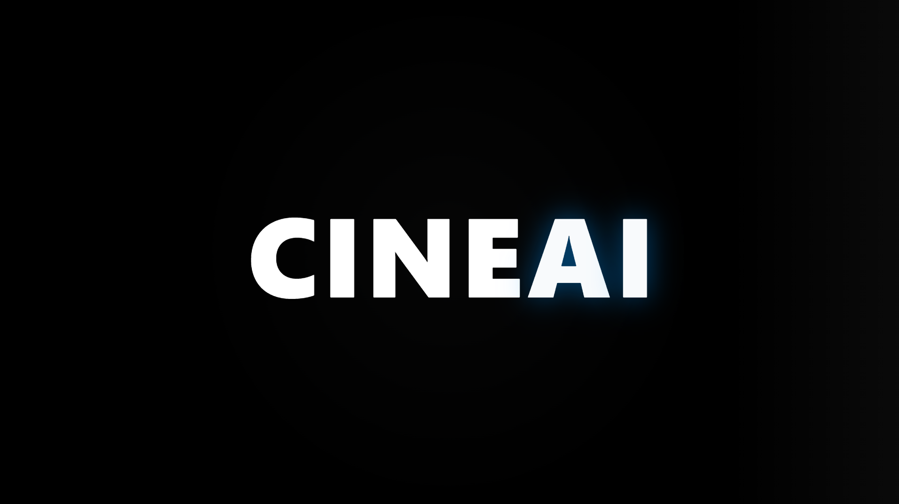

# 🎬 CINEAI – Smart Movie Recommendation System

CINEAI is an AI-powered movie recommendation web application designed to provide personalized movie suggestions using intelligent filtering techniques and real-time movie data.

## 🚀 Features
- 🎯 AI-based personalized recommendations
- 🔎 Smart search and genre filtering
- 📊 Trending, Top Rated & Popular movies
- ❤️ Add to Watchlist functionality
- 🎬 Detailed movie pages with ratings, overview & trailers
- 🌙 Modern cinematic dark UI design
- ⚡ Fast and responsive performance

## 🧠 AI/ML Concepts Used
- Content-Based Filtering
- User Preference Modeling
- Similarity Matching Algorithms
- API-based Data Integration

## 🛠 Tech Stack
- Frontend: HTML, CSS, JavaScript / React
- Backend: Node.js / Python (Flask)
- Database: Firebase / MongoDB
- Movie Data: TMDB API
- Deployment: Vercel / Netlify

## 🎯 Purpose
Built as an advanced portfolio project to demonstrate:
- AI recommendation systems
- Full-stack web development
- Clean UI/UX design
- API integration
- Real-world problem solving

---

⭐ If you like this project, give it a star!
